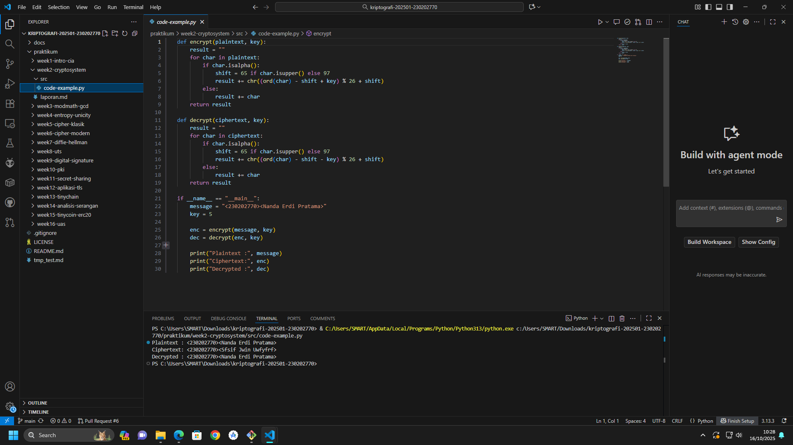

# Laporan Praktikum Kriptografi
Minggu ke-: 2
Topik: [Cryptosystem (Komponen, Enkripsi & Dekripsi, Simetris & Asimetris)]  
Nama: [Nanda Erdi Pratama]  
NIM: [230202770]  
Kelas: [5IKRB]

---

## 1. Tujuan
Setelah mengikuti praktikum ini, mahasiswa diharapkan mampu:  
1. Mengidentifikasi komponen dasar kriptosistem (plaintext, ciphertext, kunci, algoritma).  
2. Menggambarkan proses enkripsi dan dekripsi sederhana.  
3. Mengklasifikasikan jenis kriptosistem (simetris dan asimetris).  


---

## 2. Dasar Teori
CRYPTOSYSTEM

I. KOMPONEN UTAMA
1. Plaintext - Data asli yang dapat dibaca
2. Ciphertext - Data terenkripsi yang tidak dapat dibaca
3. Kunci - Data rahasia untuk proses enkripsi/dekripsi
4. Algoritma - Metode matematika untuk transformasi data

II. PROSES DASAR
- Enkripsi: Plaintext + Kunci → Ciphertext
- Dekripsi: Ciphertext + Kunci → Plaintext

III. JENIS SISTEM KUNCI

A. KRIPTOGRAFI SIMETRIS
- Ciri: Satu kunci rahasia yang sama untuk enkripsi & dekripsi
- Contoh Algoritma: AES, DES, ChaCha20
- Kelebihan:
  - Sangat cepat dan efisien
  - Kebutuhan sumber daya rendah
  - Kekuatan enkripsi tinggi
- Kelemahan:
  - Masalah distribusi kunci
  - Tidak ada non-repudiation
  - Manajemen kunci rumit untuk banyak pengguna

B. KRIPTOGRAFI ASIMETRIS
- Ciri: Sepasang kunci - publik (enkripsi) dan privat (dekripsi)
- Contoh Algoritma: RSA, ECC, ElGamal
- Kelebihan:
  - Solusi masalah distribusi kunci
  - Mendukung tanda tangan digital
  - Non-repudiation
  - Manajemen kunci lebih mudah
- Kelemahan:
  - Lambat dan membutuhkan sumber daya tinggi
  - Kunci lebih panjang untuk keamanan setara

IV. IMPLEMENTASI PRAKTIS**
Dalam sistem modern (seperti SSL/TLS):
1. Tahap Handshake: Asimetris untuk autentikasi & negosiasi kunci sesi
2. Tahap Komunikasi: Simetris untuk enkripsi data dengan kunci sesi

Kedua sistem saling melengkapi untuk mengoptimalkan keamanan dan kinerja.

---

## 3. Alat dan Bahan
(- Python 3.x  
- Visual Studio Code / editor lain  
- Git dan akun GitHub  
- Library tambahan (misalnya pycryptodome, jika diperlukan)  )

---

## 4. Langkah Percobaan
(Tuliskan langkah yang dilakukan sesuai instruksi.  
Contoh format:
1. Membuat file `caesar_cipher.py` di folder `praktikum/week2-cryptosystem/src/`.
2. Menyalin kode program dari panduan praktikum.
3. Menjalankan program dengan perintah `python caesar_cipher.py`.)

---

## 5. Source Code
(Salin kode program utama yang dibuat atau dimodifikasi.  
Gunakan blok kode:

def encrypt(plaintext, key):
    result = ""
    for char in plaintext:
        if char.isalpha():
            shift = 65 if char.isupper() else 97
            result += chr((ord(char) - shift + key) % 26 + shift)
        else:
            result += char
    return result

def decrypt(ciphertext, key):
    result = ""
    for char in ciphertext:
        if char.isalpha():
            shift = 65 if char.isupper() else 97
            result += chr((ord(char) - shift - key) % 26 + shift)
        else:
            result += char
    return result

if __name__ == "__main__":
    message = "<230202770><Nanda Erdi Pratama>"
    key = 5

    enc = encrypt(message, key)
    dec = decrypt(enc, key)

    print("Plaintext :", message)
    print("Ciphertext:", enc)
    print("Decrypted :", dec)
)

---

## 6. Hasil dan Pembahasan
(- Lampirkan screenshot hasil eksekusi program (taruh di folder `screenshots/`).  
- Berikan tabel atau ringkasan hasil uji jika diperlukan.  
- Jelaskan apakah hasil sesuai ekspektasi.  
- Bahas error (jika ada) dan solusinya. 

Hasil eksekusi program Caesar Cipher:




)

---

## 7. Jawaban Pertanyaan
(Jawab pertanyaan diskusi yang diberikan pada modul.  
- Pertanyaan 1: Komponen Utama Kriptosistem:
Plaintext - Data asli (pesan, file).
Ciphertext - Data terenkripsi (hasil acakan).
Kunci - Data rahasia untuk enkripsi & dekripsi.
Algoritma - Metode untuk mengubah plaintext ↔ ciphertext.
Intinya: Algoritma mengambil plaintext dan kunci untuk menghasilkan ciphertext. Proses sebaliknya menggunakan kunci yang sama untuk mengembalikan ciphertext menjadi plaintext.
- Pertanyaan 2: Kelebihan Kriptografi Simetris (vs Asimetris):
1.  Jauh Lebih Cepat - Efisien untuk enkripsi data dalam jumlah besar.
2.  **Sumber Daya Rendah - Cocok untuk perangkat terbatas (IoT, mobile).
3.  Lebih Kuat - Kunci yang lebih pendek memberikan tingkat keamanan setara.
4.  Implementasi Sederhana - Hanya menggunakan satu kunci.

Kelemahan Kriptografi Simetris (vs Asimetris):
1.  Masalah Distribusi Kunci - Kesulitan mengirimkan kunci rahasia dengan aman.
2.  Tidak Ada Non-Repudiation - Tidak bisa membuktikan asal pesan karena kunci dibagi.
3.  Manajemen Kunci Rumit - Membutuhkan terlalu banyak kunci unik untuk banyak pengguna.
4.  Fungsi Terbatas - Hanya untuk enkripsi, tidak untuk tanda tangan digital.

Kesimpulan:
Keduanya saling melengkapi. Asimetris (RSA/ECC) digunakan untuk membangun kepercayaan dan menukar kunci, lalu Simetris (AES) digunakan untuk mengenkripsi data utama secara cepat.
- Pertanyaan 3: Distribusi kunci adalah masalah utama dalam kriptografi simetris karena:
1. Risiko Penyadapan - Kunci rahasia harus dikirim ke penerima, tapi proses pengiriman itu sendiri rentan disadap.
2. Skalabilitas Buruk - Untuk `n` pengguna, dibutuhkan `n(n-1)/2` kunci unik. Contoh: 100 user → 4,950 kunci berbeda.
3. Paradoks Keamanan - Butuh saluran aman untuk mengirim kunci, padahal tujuan kunci adalah untuk membuat saluran aman.
4. Tidak Ada Mekanisme Bawaan - Sistem simetris murni tidak menyediakan cara aman untuk pertukaran kunci pertama.

)
---

## 8. Kesimpulan
Kriptosystem modern menggabungkan kelebihan sistem simetris dan asimetris secara sinergis. Sistem asimetris (seperti RSA) digunakan untuk autentikasi dan distribusi kunci yang aman, sementara sistem simetris (seperti AES) digunakan untuk enkripsi data massal karena kecepatan dan efisiensinya. Integrasi kedua pendekatan ini mengatasi kelemahan distribusi kunci simetris sekaligus mempertahankan kinerja optimal dalam komunikasi yang aman.

---

## 9. Daftar Pustaka
(Cantumkan referensi yang digunakan.  
Contoh:  
- Katz, J., & Lindell, Y. *Introduction to Modern Cryptography*.  
- Stallings, W. *Cryptography and Network Security*.  )

---

## 10. Commit Log
(Tuliskan bukti commit Git yang relevan.  
Contoh:
```
commit 1b624583f5d2a20d841095ceb4c844fe9b9aa2c0 (HEAD -> main, origin/main, origin/HEAD)
Author: Nanda0218 <nandaerdipratama29@gmail.com>
Date:   Thu Oct 16 11:51:57 2025 +0700

    week2-cryptosystem: implementasi Caesar Cipher dan laporan )
```
