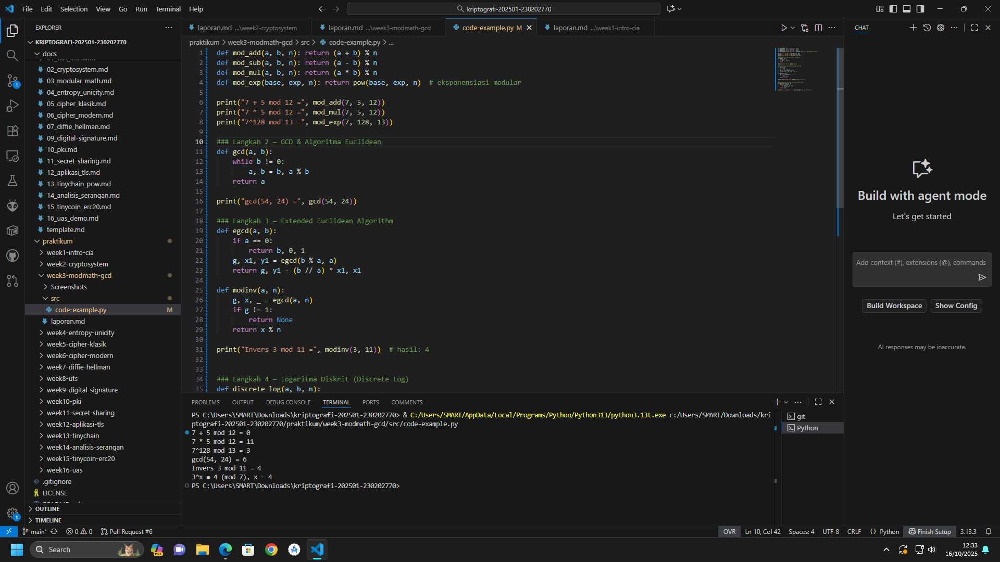

# Laporan Praktikum Kriptografi
Minggu ke-: 3
Topik: [Modular Math (Aritmetika Modular, GCD, Bilangan Prima, Logaritma Diskrit)]
Nama: [Nanda Erdi Pratama]  
NIM: [230202770]  
Kelas: [5IKRB]  

---

## 1. Tujuan
Setelah mengikuti praktikum ini, mahasiswa diharapkan mampu:  
1. Menyelesaikan operasi aritmetika modular.  
2. Menentukan bilangan prima dan menghitung GCD (Greatest Common Divisor).  
3. Menerapkan logaritma diskrit sederhana dalam simulasi kriptografi.  

---

## 2. Dasar Teori
Aritmetika modular adalah sistem bilangan sirkular yang bekerja dengan modulus tertentu, seperti operasi pada jam. Dalam kriptografi, konsep ini menjadi fondasi cipher klasik seperti Caesar cipher, dimana enkripsi dinyatakan sebagai C ≡ (P + k) mod 26 dan dekripsi sebagai P ≡ (C - k) mod 26. Operasi modular memastikan bahwa hasil perhitungan selalu berada dalam rentang terbatas, sehingga cocok untuk merepresentasikan huruf alfabet atau bit data. Konsep matematika lain yang vital dalam kriptografi modern meliputi GCD (Greatest Common Divisor) untuk menentukan kunci relatif prima, bilangan prima sebagai fondasi sistem asimetris seperti RSA, dan logaritma diskrit yang menjadi basis keamanan protokol pertukaran kunci Diffie-Hellman. Sifat-sifat matematis ini dimanfaatkan untuk membangun fungsi satu-arah (one-way function) yang mudah dihitung tetapi sangat sulit dibalikkan tanpa informasi rahasia tertentu, sehingga menjamin keamanan sistem kriptografi terhadap serangan.

---

## 3. Alat dan Bahan
(- Python 3.x  
- Visual Studio Code / editor lain  
- Git dan akun GitHub  
- Library tambahan (misalnya pycryptodome, jika diperlukan)  )

---

## 4. Langkah Percobaan
(Tuliskan langkah yang dilakukan sesuai instruksi.  
Contoh format:
1. Membuat file `caesar_cipher.py` di folder `praktikum/week2-cryptosystem/src/`.
2. Menyalin kode program dari panduan praktikum.
3. Menjalankan program dengan perintah `python caesar_cipher.py`.)

---

## 5. Source Code
(Salin kode program utama yang dibuat atau dimodifikasi.  
Gunakan blok kode:

```python
# contoh potongan kode
def encrypt(text, key):
    return ...
```
)

---

## 6. Hasil dan Pembahasan
(- Lampirkan screenshot hasil eksekusi program (taruh di folder `screenshots/`).  
- Berikan tabel atau ringkasan hasil uji jika diperlukan.  
- Jelaskan apakah hasil sesuai ekspektasi.  
- Bahas error (jika ada) dan solusinya. 

Hasil eksekusi program Caesar Cipher:




)

---

## 7. Jawaban Pertanyaan
(Jawab pertanyaan diskusi yang diberikan pada modul.  
- Pertanyaan 1: 
- Pertanyaan 2: 
- Pertanyaan 3: 
)
---

## 8. Kesimpulan
Berdasarkan percobaan dan analisis, dapat disimpulkan bahwa aritmetika modular merupakan fondasi matematis yang essential bagi kriptografi klasik maupun modern. Konsep GCD dan bilangan prima membentuk dasar keamanan sistem asimetris, sementara masalah logaritma diskrit yang sulit dipecahkan menjadi kunci pertahanan algoritma pertukaran kunci. Pemanfaatan sifat-sifat matematika ini memungkinkan pembangunan sistem kriptografi yang secara komputasi aman untuk aplikasi praktis.

Aritmetika Modular - Dasar cipher klasik (Caesar) dan modern
GCD & Bilangan Prima - Fondasi sistem asimetris seperti RSA
Logaritma Diskrit - Keamanan Diffie-Hellman dan DSA
Integrasi Simetris-Asimetris - Solusi optimal untuk keamanan & kinerja
Masalah Distribusi Kunci - Kelemahan utama simetris yang diatasi oleh asimetris

 Contoh 
Caesar Cipher: C ≡ (P + k) mod 26
Pertukaran Kunci: Diffie-Hellman menggunakan logaritma diskrit
RSA: Menggunakan faktorisasi bilangan prima yang sulit

---

## 9. Daftar Pustaka
(Cantumkan referensi yang digunakan.  
Contoh:  
- Katz, J., & Lindell, Y. *Introduction to Modern Cryptography*.  
- Stallings, W. *Cryptography and Network Security*.  )

---

## 10. Commit Log
(Tuliskan bukti commit Git yang relevan.  
Contoh:
```
commit 3f3984e2f78fd6f769c809fa774ed3ddc8c16606 (HEAD -> main, origin/main, origin/HEAD)
Author: Nanda0218 <nandaerdipratama29@gmail.com>
Date:   Thu Oct 16 12:18:29 2025 +0700

    week2-cryptosystem: implementasi Caesar Cipher dan laporan )
```
